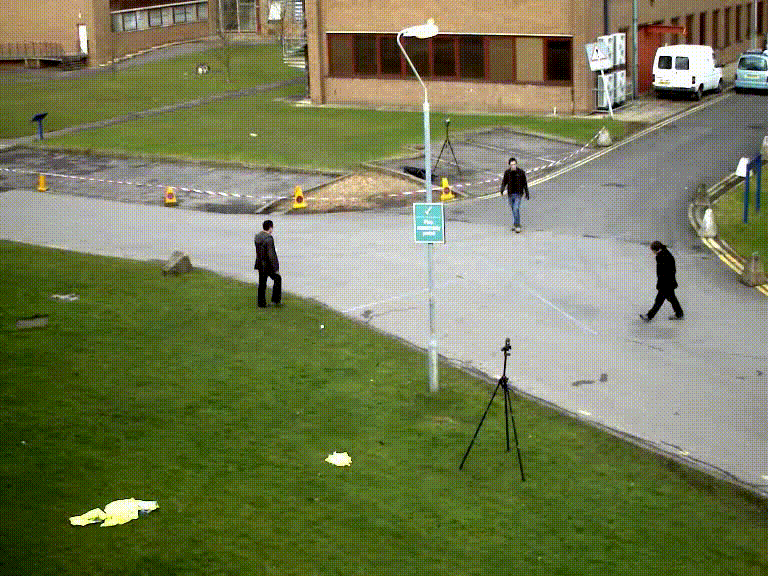

<!-- 

  Language:
    🇺🇸
  <a title="Chinese" href="./README.zh-CN.md">🇨🇳</a>

 -->

 

  «FrameDiff» implements inter-frame difference algorithm.
 
 
  
  
  

## Table of Contents

- [Table of Contents](#table-of-contents)
- [Background](#background)
- [Maintainers](#maintainers)
- [Thanks](#thanks)
- [Contributing](#contributing)
- [License](#license)

## Background

The inter-frame difference algorithm is one of the conventional motion detection algorithms. I still remember the last lesson of my undergraduate machine vision course was about learning motion detection based on inter-frame difference algorithms.

This warehouse has implemented some inter-frame difference algorithms using [OpenCV](https://github.com/opencv/opencv) or [Simd](https://github.com/ermig1979/Simd) image processing libraries.

## Maintainers

* zhujian - *Initial work* - [zjykzj](https://github.com/zjykzj)

## Thanks

* [opencv/opencv](https://github.com/opencv/opencv)
* [ermig1979/Simd](https://github.com/ermig1979/Simd)

## Contributing

Anyone's participation is welcome! Open an [issue](https://github.com/zjykzj/InterframeDiff/issues) or submit PRs.

Small note:

* Git submission specifications should be complied
  with [Conventional Commits](https://www.conventionalcommits.org/en/v1.0.0-beta.4/)
* If versioned, please conform to the [Semantic Versioning 2.0.0](https://semver.org) specification
* If editing the README, please conform to the [standard-readme](https://github.com/RichardLitt/standard-readme)
  specification.

## License

[Apache License 2.0](LICENSE) © 2023 zjykzj